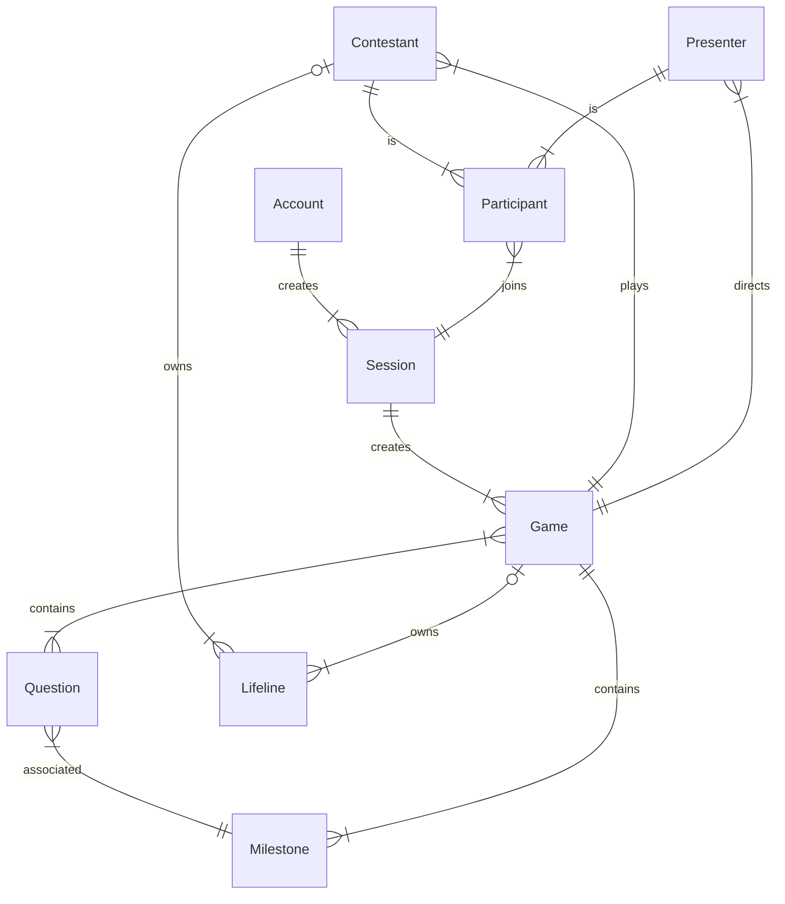
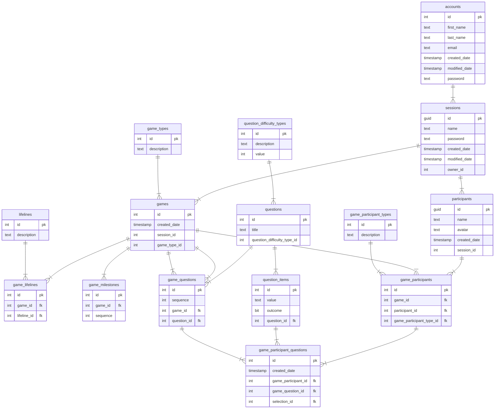

# Overview

This application permits users to play `who wants to be a millionaire` over the internet and leveraging technologies like websockets and webrtc. 

## Problem Definition

For events it can be fun to play interactive games; however with the trend towards remote working this can be difficult to facilitate in a seamless way. The objective of this application is to provide an interface that allows a `presenter` to run a game in the same way that the TV show is run.

## Requirements

MoSCoW prioritization, also known as the MoSCoW method or MoSCoW analysis, is a popular prioritization technique for managing requirements. M - Must have, S - Should have, C - Could have, W - Will not have.

### Must Have
- A user must be able to create/update an account.
- An account user must be able to start a game as an owner
- A game must permit guests to join a lobby as participants
- A game must facilitate a participant selection round to identify the contestant.
- A game must permit contestant to answer questions.
- A game must have a set number of questions that can be organised by 3 difficulties.
- A game must handle showing questions and allowing selection.
- A game must handle correct guesses and progression through the questions.
- A game must support use of the 50/50 lifeline.
- A game must be marked as lost when an incorrect guess is made.
- A game must facilitate milestones 
- A game must permit a maximum of 2 minutes per question.

### Should Have
- A game should use real time communication for game updates.
- A game should skip participant selection if there is only 1 participant.

### Could Have
- An owner could be able to set a presenter
- A game could support use of the ask a friend lifeline.
- A game could support use of the ask the audience lifeline.

### Will Not Have
- The system will not track historical games and trends.
- The system will not tracked connected users and prompt for inactivity/lost connections.
- The system will not support an interface to administrate questions.


## Domain Model Diagram

This diagram demostrates the main domains for WWTBAM, along with a short description on how they interact.



## Entity Relationship Diagram

This diagram demostrates the table structure along with the cardinality that is used for the WWTBAM databse.



## API Specifications

### Accounts

`GET /accounts`
###### Returns a list of accounts

Responses: 
- `200 OK`
```json
[
  {
    "id": 1,
    "email_address": "mark.brown@unosquare.com",
    "first_name": "Mark",
    "last_name": "Brown"
  },
  {
    "id": 2,
    "email_address": "adam.kane@unosquare.com",
    "first_name": "Adam",
    "last_name": "Kane"
  }
]
```

---

`GET /accounts/{accountId}`
###### Returns an account

Responses: 
- `200 OK`
- `404 Not Found`
```json
{
    "id": 1,
    "email_address": "mark.brown@unosquare.com",
    "first_name": "Mark",
    "last_name": "Brown",
    "games": []
}
```

---

`POST /accounts`
###### Creates an account

Request:
```json
  {
    "email_address": "mark.brown@unosquare.com",
    "first_name": "Mark",
    "last_name": "Brown",
    "password": "ABC12345!"
  }
```

Responses: 
- `201 Created`
- `400 Bad Request`
```json
{
    "id": 1,
    "email_address": "mark.brown@unosquare.com",
    "first_name": "Mark",
    "last_name": "Brown",
    "password": "ABC12345!"
}
```

---

`PUT /accounts/{accountId}`
###### Updates an account
_NOTE: Password is an optional field, if it is not supplied, it is not updated._

Request:
```json
  {
    "email_address": "mark.brown@unosquare.com",
    "first_name": "Mark",
    "last_name": "Brown",
    "password": "ABC12345!"
  }
```

Responses: 
- `204 No Content`
- `400 Bad Request`
- `404 Not Found`

---

`DELETE /accounts/{accountId}`
###### deletes an account
_NOTE: This actually performs a 'soft' deletion, we don't remove the account from the database, we simply mark it as inactive._

Response: `204 No Content`

---

### Games
