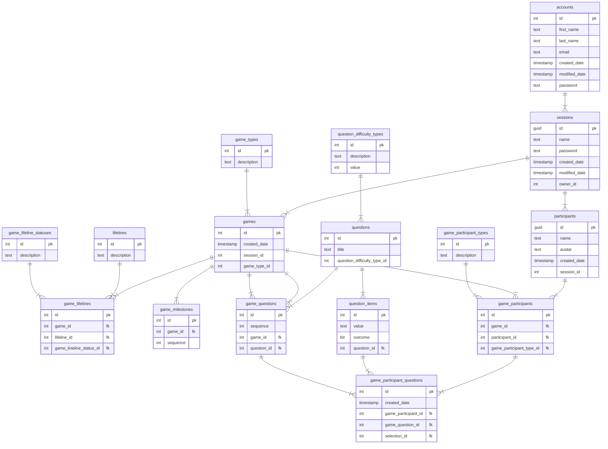

# Overview

This application permits users to play `who wants to be a millionaire` over the internet and leveraging technologies like websockets and webrtc. 

## Problem Definition

For events it can be fun to play interactive games; however with the trend towards remote working this can be difficult to facilitate in a seamless way. The objective of this application is to provide an interface that allows a `presenter` to run a game in the same way that the TV show is run.

## Requirements

MoSCoW prioritization, also known as the MoSCoW method or MoSCoW analysis, is a popular prioritization technique for managing requirements. M - Must have, S - Should have, C - Could have, W - Will not have.

### Must Have
- A user must be able to create/update an account.
- An account user must be able to start a game as an owner
- A game must permit guests to join a lobby as participants
- A game must facilitate a participant selection round to identify the contestant.
- A game must permit contestant to answer questions.
- A game must have a set number of questions that can be organised by 3 difficulties.
- A game must handle showing questions and allowing selection.
- A game must handle correct guesses and progression through the questions.
- A game must support use of the 50/50 lifeline.
- A game must be marked as lost when an incorrect guess is made.
- A game must facilitate milestones 
- A game must permit a maximum of 2 minutes per question.

### Should Have
- A game should use real time communication for game updates.
- A game should skip participant selection if there is only 1 participant.

### Could Have
- An owner could be able to set a presenter
- A game could support use of the ask a friend lifeline.
- A game could support use of the ask the audience lifeline.

### Will Not Have
- The system will not track historical games and trends.
- The system will not tracked connected users and prompt for inactivity/lost connections.
- The system will not support an interface to administrate questions.


## Domain Model Diagram

This diagram demostrates the main domains for WWTBAM, along with a short description on how they interact.


## Entity Relationship Diagram

This diagram demostrates the table structure along with the cardinality that is used for the WWTBAM databse.



## API Specifications

### Accounts

`GET /accounts`
###### Returns a list of accounts

Responses: 
- `200 OK`
```json
[
  {
    "id": 1,
    "emailAddress": "mark.brown@unosquare.com",
    "firstName": "Mark",
    "lastName": "Brown"
  },
  {
    "id": 2,
    "emailAddress": "adam.kane@unosquare.com",
    "firstName": "Adam",
    "lastName": "Kane"
  }
]
```

---

`GET /accounts/{accountId}`
###### Returns an account

Responses: 
- `200 OK`
- `404 Not Found`
```json
{
    "id": 1,
    "emailAddress": "mark.brown@unosquare.com",
    "firstName": "Mark",
    "lastName": "Brown",
    "games": []
}
```

---

`POST /accounts`
###### Creates an account

Request:
```json
{
    "emailAddress": "mark.brown@unosquare.com",
    "firstName": "Mark",
    "lastName": "Brown",
    "password": "ABC12345!"
}
```

Responses: 
- `201 Created`
- `400 Bad Request`
```json
{
    "id": 1,
    "emailAddress": "mark.brown@unosquare.com",
    "firstName": "Mark",
    "lastName": "Brown"
}
```

---

`PUT /accounts/{accountId}`
###### Updates an account
_NOTE: Password is an optional field, if it is not supplied, it is not updated._

Request:
```json
{
    "emailAddress": "mark.brown@unosquare.com",
    "firstName": "Mark",
    "lastName": "Brown",
    "password": "ABC12345!"
}
```

Responses: 
- `204 No Content`
- `400 Bad Request`
- `404 Not Found`

---

`DELETE /accounts/{accountId}`
###### deletes an account
_NOTE: This actually performs a 'soft' deletion, we don't remove the account from the database, we simply mark it as inactive._

Response: `204 No Content`

---

### Sessions

`GET /sessions/{sessionId}`
###### Returns a session

Responses: 
- `200 OK`
- `404 Not Found`
```json
{
    "id": "4205d325-8fbb-486f-be04-0b8ac46b0cc1",
    "name": "test session",
    "createdDate": "2023-01-11 10:27:21.240752"
}
```

`POST /sessions`
###### Creates a session

Request:
```json
{
    "name": "test session",
    "password": "ABC12345!"
}
```

Responses: 
- `201 Created`
- `400 Bad Request`
```json
{
    "id": 1,
    "name": "test session"
}
```

---

`DELETE /sessions/{sessionId}`
###### deletes an account
_NOTE: There should be validation here for open/ongoing games._

Response: `204 No Content`

---

### Sessions Participants

`GET /sessions/{sessionId}/participants`
###### Returns a session participants

Responses: 
- `200 OK`
- `404 Not Found`
```json
[
    {
        "id": "4205d325-8fbb-486f-be04-0b8ac46b0cc1",
        "name": "Mark Brown",
        "avatar": "https://somesite.com/test.png",
        "createdDate": "2023-01-11 10:27:21.240752"
    }
]
```

---


`POST /sessions/{sessionId}/participants`
###### creates a participant for a session

Request:
```json
{
    "name": "Mark Brown",
    "avatar": "https://somesite.com/test.png"
}
```

Responses: 
- `201 OK`
- `404 Not Found`
```json
{
    "id": "4205d325-8fbb-486f-be04-0b8ac46b0cc1",
    "name": "Mark Brown",
    "avatar": "https://somesite.com/test.png",
    "createdDate": "2023-01-11 10:27:21.240752"
}
```

---

### Session Games

`GET /sessions/{sessionId}/games`
###### Returns a list of games for a session

Responses: 
- `200 OK`
```json
[
  {
    "id": 1,
    "gameTypeId": 1,
    "createdDate": "2023-01-11 10:27:21.240752"
  },
  {
    "id": 2,
    "gameTypeId": 2,
    "createdDate": "2023-01-11 11:27:21.240752"
  }
]
```

---

`POST /sessions/{sessionId}/games`
###### creates a game for a session

_NOTE: The game status will be determined by the questions dynamically rather than maintaining a DB state._

Request:
```json
{
    "game_type_id": 1,
    "participants": [
        {
             "participantId": "885ac4fe-beb9-41ac-b3f0-55e1a934f6ac",
             "participantTypeId": 1,
        },
        {
             "participantId": "885ac4fe-beb9-41ac-b3f0-55e1a934f6ac",
             "participantTypeId": 2,
        }
    ]
}
```

Responses: 
- `201 OK`
- `400 Bad Request`
- `404 Not Found`
```json
{
    "id": 1,
    "gameTypeId": 1,
    "status": "Not Started",
    "createdDate": "2023-01-11 11:27:21.240752",
    "participants" : 
    [
        {
            "id": 1,
            "participantId": "4205d325-8fbb-486f-be04-0b8ac46b0cc1",
            "name": "Mark Brown",
            "avatar": "https://somesite.com/test.png",
            "createdDate": "2023-01-11 10:27:21.240752",
            "participantTypeId": 1
        },
        {
            "id": 2,
            "participantId": "885ac4fe-beb9-41ac-b3f0-55e1a934f6ac",
            "name": "Adam Kane",
            "avatar": "https://somesite.com/adam.png",
            "createdDate": "2023-01-11 11:27:21.240752",
            "participantTypeId": 2
        }
    ],
    "currentQuestion": 0,
    "lifelines": [
        {
            "id": 1,
            "name": "Phone a friend",
            "status": "Available",
        },
        {
            "id": 2,
            "name": "Ask the audience",
            "status": "Available",
        },
        {
            "id": 3,
            "name": "50/50",
            "status": "Available",
        }
    ]
    "milestones:" [
       {
        "sequence": 5
       },
       {
        "sequence": 7
       },
       {
        "sequence": 12
       }
    ],
}
```

---

### Games

`GET /games/{gameId}`
###### Returns game details

Responses: 
- `200 OK`
- `404 Not Found`
```json
{
    "id": 1,
    "gameTypeId": 1,
    "createdDate": "2023-01-11 10:27:21.240752",
    "currentQuestion": 6,
    "status": "In Progress",
    "milestones:" [
       {
        "sequence": 5
       },
       {
        "sequence": 7
       },
       {
        "sequence": 12
       }
    ],
}
```

---

`DELETE /games/{gameId}`
###### Deletes a game

Response: `204 No Content`

---

### Game Participants

`POST /games/{gameId}/participants`
###### creates a participant for an existing game

Request:
```json
{
    "participantId": "885ac4fe-beb9-41ac-b3f0-55e1a934f6ac",
    "participantTypeId": 1,
}
```

Responses: 
- `201 OK`
- `404 Not Found`
```json
 [
    {
        "id": 1,
        "participantId": "4205d325-8fbb-486f-be04-0b8ac46b0cc1",
        "name": "Mark Brown",
        "avatar": "https://somesite.com/test.png",
        "createdDate": "2023-01-11 10:27:21.240752",
        "participantTypeId": 1
    },
    {
        "id": 2,
        "participantId": "885ac4fe-beb9-41ac-b3f0-55e1a934f6ac",
        "name": "Adam Kane",
        "avatar": "https://somesite.com/adam.png",
        "createdDate": "2023-01-11 11:27:21.240752",
        "participantTypeId": 2
    }
]
```

`DELETE /games/{gameId}/participants/{participantId}`
###### Deletes a participant from a game

Response: `204 No Content`

---

`GET /games/{gameId}/participants/types`
###### Returns participant types applicable for the game.

Responses: 
- `200 OK`
```json
[
  {
    "id": 1,
    "description": "Presenter"
  },
  {
    "id": 2,
    "description": "Contestant"
  },
  {
    "id": 3,
    "description": "Audience"
  },
]
```

---

### Game Questions

`GET /games/{gameId}/questions`
###### Returns questions for the game.

Responses: 
- `200 OK`
```json
[
    {
        "id": 1,
        "sequence": 1,
        "difficulty": "Easy",
        "title": "Is water wet?",
        "items": [
            {
                "id": 1,
                "value": "Yes"
            },
            {
                "id": 2,
                "value": "No"
            },
            {
                "id": 3,
                "value": "Maybe"
            },
            {
                "id": 4,
                "value": "Can you repeat the question?"
            },
        ],
        "selection": 1,
        "outcome": true
    },
    {
        "id": 2,
        "sequence": 2,
        "difficulty": "Medium",
        "title": "Where is London located?",
        "items": [
            {
                "id": 5,
                "value": "England"
            },
            {
                "id": 6,
                "value": "France"
            },
            {
                "id": 7,
                "value": "Spain"
            },
            {
                "id": 8,
                "value": "Mariana Trench"
            },
        ],
        "selection": null,
        "outcome": null
    },
]
```

---

`POST /games/{gameId}/questions`
###### creates an answer for a question

Request:
```json
{
    "questionId": 1,
    "selectionId": 1 ,
}
```

Responses: 
- `201 OK`
- `404 Not Found`
```json
{
    "outcome": true
}
```

---